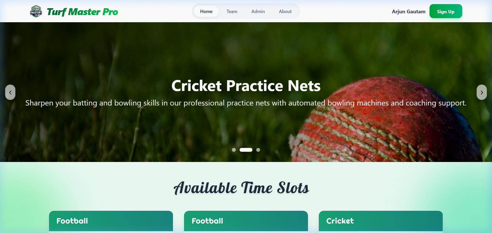
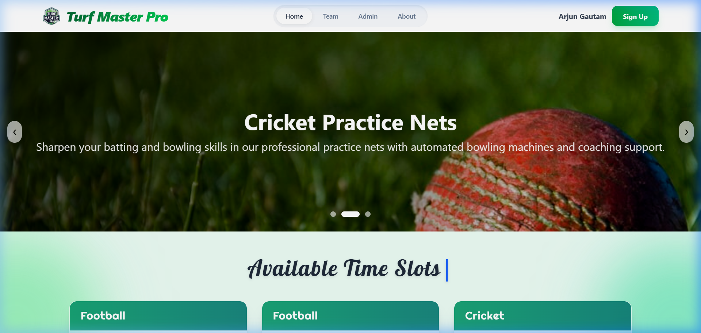

<h1 align="center">
  ⚽ TurfMasterPro
</h1>

<p align="center">
  <strong>A full-stack turf booking & management platform</strong><br/>
  Book sports turfs online — Football, Cricket & more.
</p>

<p align="center">
  
  
  
  
  
  
</p>

---

## 📖 Table of Contents

- [Overview](#-overview)
- [Tech Stack](#-tech-stack)
- [Architecture](#-architecture)
- [Project Structure](#-project-structure)
- [Prerequisites](#-prerequisites)
- [Getting Started](#-getting-started)
- [API Endpoints](#-api-endpoints)
- [Frontend Routes](#-frontend-routes)
- [Database](#-database)
- [Screenshots](#-screenshots)
- [Contributing](#-contributing)
- [License](#-license)

---

## 🌟 Overview

**TurfMasterPro** is a modern, full-stack web application for managing and booking sports turf slots. It allows customers to browse available turfs, view schedules, register/login, and book time slots for games like Football and Cricket. An admin panel is included for managing slots, users, and carousel content.

### Key Features

| Feature | Description |
|---|---|
| 🏟️ **Turf Booking** | Browse and book available time slots for Football & Cricket |
| 🔐 **Authentication** | User registration and login with email/password |
| 👤 **User Profiles** | Manage personal info — name, email, gender, DOB, mobile |
| 🛠️ **Admin Dashboard** | Full CRUD for slots, users, carousels, and confirmations |
| 🎠 **Dynamic Carousel** | Configurable hero carousel with images and descriptions |
| 📱 **Responsive UI** | Mobile-first design with Tailwind CSS |
| 📄 **Booking Confirmations** | View and manage booking receipts |

---

## 🛠️ Tech Stack

### Frontend — `TurfMasterPro-main/`

| Technology | Version | Purpose |
|---|---|---|
| [React](https://react.dev/) | 19.2 | UI library with component-based architecture |
| [Vite](https://vite.dev/) | 7.2 | Lightning-fast build tool & dev server with HMR |
| [React Router](https://reactrouter.com/) | 7.10 | Client-side routing & navigation |
| [Tailwind CSS](https://tailwindcss.com/) | 4.1 | Utility-first CSS framework |
| [Axios](https://axios-http.com/) | 1.13 | HTTP client for API communication |
| [React Hook Form](https://react-hook-form.com/) | 7.69 | Performant form handling & validation |
| [React Redux](https://react-redux.js.org/) | 9.2 | Global state management |
| [date-fns](https://date-fns.org/) | 4.1 | Date utility library |
| [React Compiler](https://react.dev/learn/react-compiler) | 1.0 | Automatic memoization (Babel plugin) |

### Backend — `fullstack-backend-master/`

| Technology | Version | Purpose |
|---|---|---|
| [Spring Boot](https://spring.io/projects/spring-boot) | 2.6.7 | Backend framework with embedded Tomcat |
| [Spring Data JPA](https://spring.io/projects/spring-data-jpa) | — | ORM & repository abstraction over Hibernate |
| [Hibernate](https://hibernate.org/) | — | JPA implementation for database operations |
| [H2 Database](https://h2database.com/) | — | In-memory database for development (zero setup) |
| [MySQL](https://www.mysql.com/) | 8.x | Production-ready relational database (optional) |
| [Maven](https://maven.apache.org/) | — | Build automation & dependency management |
| [Java](https://openjdk.org/) | 17 | Programming language |

---

## 🏗️ Architecture

```
┌─────────────────────┐         HTTP (REST)         ┌─────────────────────────┐
│                     │ ◄──────────────────────────► │                         │
│   React Frontend    │      localhost:5173           │   Spring Boot Backend   │
│   (Vite + Tailwind) │      ──────────►             │   (Port 8080)           │
│                     │      localhost:8080           │                         │
└─────────────────────┘                              └────────────┬────────────┘
                                                                  │
                                                          Spring Data JPA
                                                          + Hibernate ORM
                                                                  │
                                                     ┌────────────▼────────────┐
                                                     │     H2 (Dev) / MySQL    │
                                                     │       Database          │
                                                     └─────────────────────────┘
```

- The **frontend** communicates with the **backend** via RESTful API calls using Axios.
- The **backend** exposes CRUD endpoints and handles business logic.
- **Spring Data JPA** manages all database interactions through repository interfaces.
- **CORS** is configured to allow cross-origin requests from the frontend.

---

## 📁 Project Structure

```
TurfMasterPro/
│
├── TurfMasterPro-main/                # 🖥️  Frontend (React + Vite)
│   ├── public/                        #     Static assets
│   ├── src/
│   │   ├── components/
│   │   │   ├── Admin.jsx              #     Admin dashboard (CRUD panel)
│   │   │   ├── Carousel.jsx           #     Hero carousel component
│   │   │   ├── Home.jsx               #     Landing page
│   │   │   ├── Login.jsx              #     Login form
│   │   │   ├── Registration.jsx       #     Registration form
│   │   │   ├── Slot.jsx               #     Slot booking component
│   │   │   ├── Footer.jsx             #     Footer component
│   │   │   ├── ErrorPage.jsx          #     404 / error view
│   │   │   └── Test.jsx               #     Testing component
│   │   ├── layout/
│   │   │   └── MainLayout.jsx         #     App layout wrapper
│   │   ├── Header.jsx                 #     Navigation header
│   │   ├── main.jsx                   #     App entry point & router config
│   │   └── index.css                  #     Global styles (Tailwind import)
│   ├── index.html                     #     HTML entry point
│   ├── vite.config.js                 #     Vite configuration
│   ├── package.json                   #     Frontend dependencies
│   └── eslint.config.js               #     Linting configuration
│
├── fullstack-backend-master/          # ⚙️  Backend (Spring Boot)
│   ├── src/main/java/com/codewitharjun/fullstackbackend/
│   │   ├── FullstackBackendApplication.java   # Spring Boot entry point
│   │   ├── DataSeeder.java                    # Auto-seeds dummy data
│   │   ├── controller/
│   │   │   ├── UserController.java            # /user, /users, /login
│   │   │   ├── SlotController.java            # /slot, /slots
│   │   │   ├── CarouselController.java        # /carousel, /carousels
│   │   │   └── ConfirmationController.java    # /confirmation, /confirmations
│   │   ├── model/
│   │   │   ├── User.java                      # User entity
│   │   │   ├── Slot.java                      # Booking slot entity
│   │   │   ├── Carousel.java                  # Carousel item entity
│   │   │   ├── Confirmation.java              # Booking confirmation entity
│   │   │   ├── Gender.java                    # Gender enum
│   │   │   └── LoginRequest.java              # Login DTO
│   │   ├── repository/
│   │   │   ├── UserRepository.java            # User JPA repository
│   │   │   ├── SlotRepository.java            # Slot JPA repository
│   │   │   ├── CarouselRepository.java        # Carousel JPA repository
│   │   │   └── ConfirmationRepository.java    # Confirmation JPA repository
│   │   └── exception/
│   │       ├── UserNotFoundException.java     # Custom exception
│   │       └── UserNotFoundAdvice.java        # Exception handler
│   ├── src/main/resources/
│   │   └── application.properties             # Database & server config
│   ├── pom.xml                                # Maven dependencies
│   └── mvnw / mvnw.cmd                        # Maven wrapper scripts
│
├── .gitignore                         # Root gitignore
└── README.md                          # 📄 This file
```

---

## ✅ Prerequisites

Make sure you have the following installed before running the project:

| Requirement | Version | Download |
|---|---|---|
| **Java JDK** | 17 or higher | [Download](https://adoptium.net/) |
| **Node.js** | 18 or higher | [Download](https://nodejs.org/) |
| **npm** | 9 or higher | Comes with Node.js |
| **Git** | Latest | [Download](https://git-scm.com/) |

> **Note:** MySQL is **not required** for development. The project ships with H2 in-memory database by default.

---

## 🚀 Getting Started

### 1. Clone the Repository

```bash
git clone https://github.com/your-username/TurfMasterPro.git
cd TurfMasterPro
```

### 2. Start the Backend

```bash
cd fullstack-backend-master

# Windows
.\mvnw.cmd spring-boot:run

# macOS / Linux
./mvnw spring-boot:run
```

The backend will start on **`http://localhost:8080`**. You should see:
```
=== Seeding dummy data ===
  ✔ 3 users created
  ✔ 6 slots created
  ✔ 3 carousel items created
  ✔ 1 confirmation created
=== Dummy data seeding complete! ===
Started FullstackBackendApplication in X.XX seconds
```

### 3. Start the Frontend

Open a **new terminal**:

```bash
cd TurfMasterPro-main

# Install dependencies (first time only)
npm install

# Start the dev server
npm run dev
```

The frontend will start on **`http://localhost:5173`**.

### 4. Open the Application

Navigate to **`http://localhost:5173`** in your browser. 🎉

---

## 📡 API Endpoints

All endpoints are served from `http://localhost:8080`.

### Users

| Method | Endpoint | Description |
|---|---|---|
| `POST` | `/user` | Create a new user |
| `GET` | `/users` | Get all users |
| `GET` | `/user/{id}` | Get user by ID |
| `PUT` | `/user/{id}` | Update user |
| `DELETE` | `/user/{id}` | Delete user |
| `POST` | `/login` | Authenticate user (email + password) |

### Slots

| Method | Endpoint | Description |
|---|---|---|
| `POST` | `/slot` | Create a new slot |
| `GET` | `/slots` | Get all slots |
| `GET` | `/slot/{id}` | Get slot by ID |
| `PUT` | `/slot/{id}` | Update slot |
| `DELETE` | `/slot/{id}` | Delete slot |

### Carousels

| Method | Endpoint | Description |
|---|---|---|
| `POST` | `/carousel` | Create a carousel item |
| `GET` | `/carousels` | Get all carousel items |
| `GET` | `/carousel/{id}` | Get carousel by ID |
| `PUT` | `/carousel/{id}` | Update carousel item |
| `DELETE` | `/carousel/{id}` | Delete carousel item |

### Confirmations

| Method | Endpoint | Description |
|---|---|---|
| `POST` | `/confirmation` | Create a booking confirmation |
| `GET` | `/confirmations` | Get all confirmations |
| `GET` | `/confirmation/{id}` | Get confirmation by ID |
| `PUT` | `/confirmation/{id}` | Update confirmation |
| `DELETE` | `/confirmation/{id}` | Delete confirmation |

---

## 🗺️ Frontend Routes

| Route | Component | Description |
|---|---|---|
| `/` | `Home` | Landing page with carousel |
| `/login` | `Login` | User login form |
| `/registration` | `Registration` | New user registration |
| `/admin` | `Admin` | Admin dashboard (CRUD) |
| `/member` | *Placeholder* | Member page (coming soon) |
| `/contact` | *Placeholder* | Contact page (coming soon) |

---

## 🗄️ Database

### Development (Default — H2 In-Memory)

No setup required. Data is auto-seeded on startup and resets on every restart.

- **H2 Console:** `http://localhost:8080/h2-console`
- **JDBC URL:** `jdbc:h2:mem:turfmasterpro`
- **Username:** `sa`
- **Password:** *(leave blank)*

### Production (MySQL)

To switch to MySQL:

1. Install MySQL and create the database:
   ```sql
   CREATE DATABASE turfMaxProBackend;
   ```

2. Update `fullstack-backend-master/src/main/resources/application.properties`:
   ```properties
   spring.datasource.url=jdbc:mysql://localhost:3306/turfMaxProBackend
   spring.datasource.username=root
   spring.datasource.password=YOUR_PASSWORD
   spring.datasource.driver-class-name=com.mysql.cj.jdbc.Driver
   spring.jpa.hibernate.ddl-auto=update
   ```

3. Update `pom.xml` — replace the H2 dependency with MySQL:
   ```xml
   <dependency>
       <groupId>mysql</groupId>
       <artifactId>mysql-connector-java</artifactId>
       <scope>runtime</scope>
   </dependency>
   ```

### Entity Relationship

```
┌──────────┐     ┌──────────┐     ┌──────────────┐     ┌──────────┐
│   User   │     │   Slot   │     │ Confirmation │     │ Carousel │
├──────────┤     ├──────────┤     ├──────────────┤     ├──────────┤
│ userId   │     │ slotId   │     │ confirmId    │     │ id       │
│ fullName │     │ bookDate │     │ customerId   │     │ title    │
│ email    │     │ gameType │     │ slotId       │     │ desc     │
│ password │     │ startTime│     │ customerName │     │ img      │
│ gender   │     │ endTime  │     │ mobileNumber │     └──────────┘
│ mobile   │     │ status   │     │ bookingDate  │
│ dob      │     │ price    │     │ gameType     │
└──────────┘     └──────────┘     │ startTime    │
                                  │ endTime      │
                                  └──────────────┘
```

---

## 📸 Screenshots

### Home Page (Carousel & Slots)


### User Dashboard (After Login)


---

## 🤝 Contributing

1. **Fork** the repository
2. **Create** a feature branch: `git checkout -b feature/amazing-feature`
3. **Commit** your changes: `git commit -m 'Add amazing feature'`
4. **Push** to the branch: `git push origin feature/amazing-feature`
5. **Open** a Pull Request

---

## 📄 License

This project is open source and available under the [MIT License](LICENSE).

---

<p align="center">
  Built with ❤️ using React, Spring Boot & Tailwind CSS
</p>
